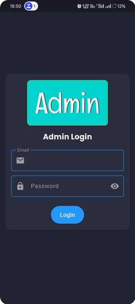
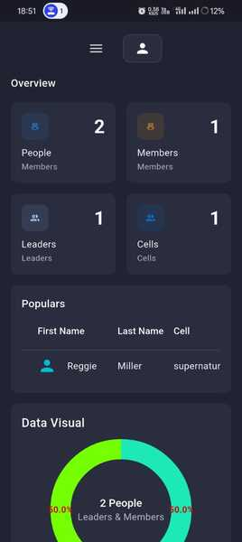
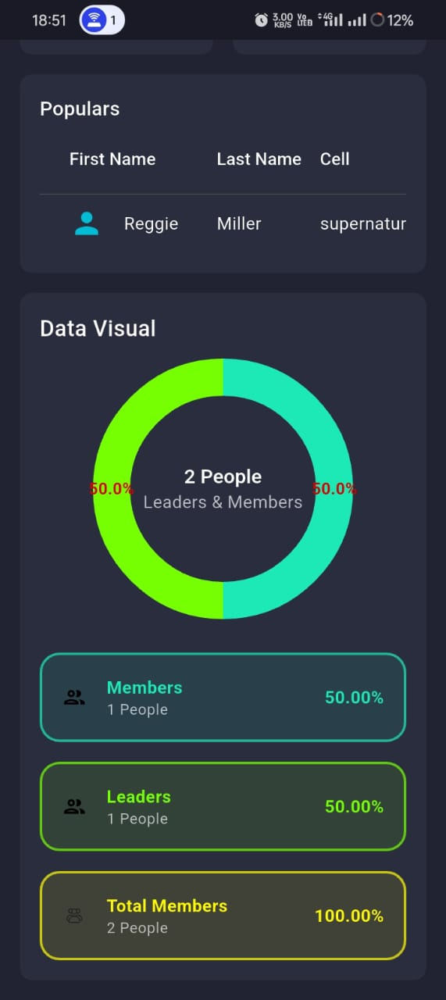
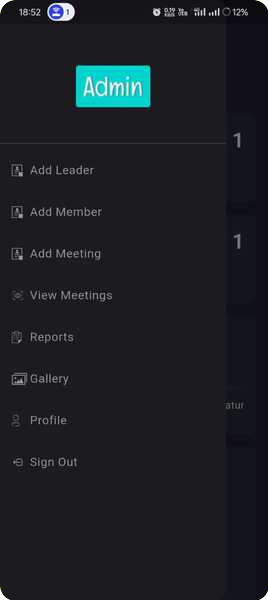

# Admin Dashboard Flutter App

<p align="center">
  
  
  
  
  
  
  
  /<YOUR_REPO_NAME>?style=for-the-badge" alt="License"/>
</p>

---

## 🚀 Overview

A modern, cross-platform **Admin Dashboard** built with Flutter. This application provides a comprehensive interface for managing members, leaders, cells, meetings, and reports, with seamless integration to Firebase Firestore. Designed for organizations and teams that need robust data visualization, reporting, and user management tools.

---

## ✨ Features

- 📊 **Dashboard**: Visualize key metrics (members, leaders, cells) with interactive charts
- 🔐 **User Authentication**: Secure login and sign-out
- 👤 **Profile Management**: View and update user profiles
- 🧑‍🤝‍🧑 **Leaders & Members**: Add, view, and manage leaders and members
- 🗓️ **Meetings**: Schedule, view, and manage meetings
- 📁 **Reports**: Generate, export (CSV), and share detailed reports
- 🖼️ **Gallery**: Manage and view images
- ☁️ **Firebase Firestore**: Real-time data storage and retrieval
- 📱 **Multi-Platform**: Runs on Android, iOS, Web, Windows, Linux, and macOS

---

## 🛠️ Tech Stack

- [Flutter](https://flutter.dev/) & [Dart](https://dart.dev/)
- [Firebase Firestore](https://firebase.google.com/products/firestore)
- [fl_chart](https://pub.dev/packages/fl_chart) (charts & graphs)
- [share_plus](https://pub.dev/packages/share_plus) (sharing)
- [csv](https://pub.dev/packages/csv) (CSV export)
- [intl](https://pub.dev/packages/intl) (internationalization)
- [path_provider](https://pub.dev/packages/path_provider) (file storage)

---

## 📸 Screenshots

<!-- Add your screenshots here -->
<p align="center">
  
  
  
  
</p>

---

## 🚦 Getting Started

### Prerequisites
- [Flutter SDK](https://flutter.dev/docs/get-started/install)
- [Firebase Project](https://console.firebase.google.com/)
- Dart 3.0+

### Installation

1. **Clone the repository:**
   ```bash
   git clone https://github.com/<YOUR_GITHUB_USERNAME>/<YOUR_REPO_NAME>.git
   cd <YOUR_REPO_NAME>
   ```
2. **Install dependencies:**
   ```bash
   flutter pub get
   ```
3. **Configure Firebase:**
   - Add your `google-services.json` (Android), `GoogleService-Info.plist` (iOS), and web config as per [FlutterFire docs](https://firebase.flutter.dev/docs/overview/).
   - Update `lib/firebase_options.dart` if using [FlutterFire CLI](https://firebase.flutter.dev/docs/cli/).
4. **Run the app:**
   ```bash
   flutter run
   ```

---

## 📚 Usage

- **Login** with your credentials
- **Navigate** the dashboard to view analytics
- **Manage** members, leaders, and meetings from the sidebar
- **Generate and export reports** from the Reports section
- **Share reports** via email or other platforms
- **View and manage images** in the Gallery

---

## 🤝 Contributing

Contributions are welcome! Please follow these steps:

1. Fork the repository
2. Create your feature branch (`git checkout -b feature/YourFeature`)
3. Commit your changes (`git commit -am 'Add new feature'`)
4. Push to the branch (`git push origin feature/YourFeature`)
5. Open a Pull Request

---

## 📄 License

This project is licensed under the MIT License. See the [LICENSE](LICENSE) file for details.

---

## 🙏 Acknowledgements

- [Flutter](https://flutter.dev/)
- [Firebase](https://firebase.google.com/)
- [fl_chart](https://pub.dev/packages/fl_chart)
- [share_plus](https://pub.dev/packages/share_plus)
- [csv](https://pub.dev/packages/csv)

---

<p align="center">
  <b>Made with ❤️ using Flutter</b>
</p>
